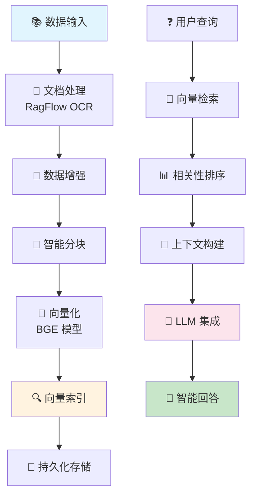
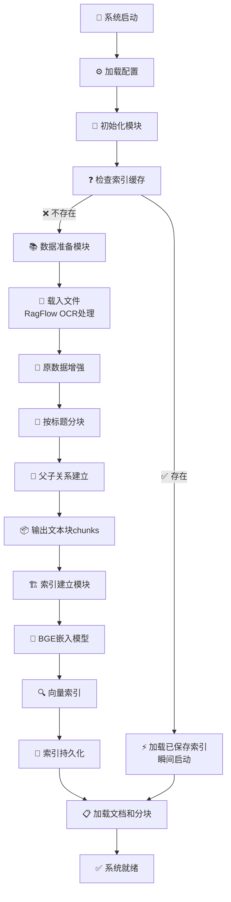

**注意：以下写好了大体的框架，但是具体使用还在开发中**

**教程来自：https://github.com/datawhalechina/all-in-rag**

# 🚀 RAG Python

> 一个基于 Python 的高性能检索增强生成 (RAG) 系统，集成先进的文档处理和向量检索技术

[](https://www.python.org/)
[](LICENSE)
[]()
[]()

## 📋 目录

- [✨ 特性](#-特性)
- [🏗️ 系统架构](#️-系统架构)
- [🚀 快速开始](#-快速开始)
- [📁 项目结构](#-项目结构)
- [⚙️ 配置说明](#️-配置说明)
- [🔄 工作流程](#-工作流程)
- [🛠️ 技术栈](#️-技术栈)
- [📖 使用指南](#-使用指南)
- [🤝 贡献](#-贡献)

## ✨ 特性

### 🎯 核心功能
- **🧠 智能文档处理**: 集成 RagFlow OCR 技术，支持多格式文档解析
- **⚡ 高效向量检索**: 基于 BGE 嵌入模型的向量相似度搜索
- **💾 智能缓存机制**: 索引持久化存储，实现瞬间启动
- **🔧 灵活配置管理**: 多层次配置系统，支持默认配置、自定义配置和环境变量
- **📝 结构化分块**: 按标题智能分块，建立文档父子关系

### 🚀 性能优势
- **⚡ 快速启动**: 索引缓存机制，避免重复构建
- **🎯 高精度检索**: BGE 向量模型，检索精度业界领先
- **📊 智能排序**: 基于相关性的结果排序算法
- **🔧 模块化设计**: 便于维护和功能扩展

## 🏗️ 系统架构



## 🚀 快速开始

### 📦 环境要求

- **Python**: 3.8+
- **操作系统**: Windows/macOS/Linux
- **内存**: 建议 8GB+
- **存储**: 根据文档大小调整

### 🔧 安装步骤

1. **克隆项目**
   ```bash
   git clone https://github.com/your-username/RAG_py.git
   cd RAG_py
   ```

2. **安装依赖**
   ```bash
   pip install -r requirements.txt
   ```

3. **配置环境**
   ```bash
   # 复制配置模板
   cp config.py.example config.py

   # 编辑配置文件
   nano config.py
   ```

4. **启动系统**
   ```bash
   python main.py
   ```

### ⚡ 一键启动脚本

```bash
# 使用预设配置快速启动
bash scripts/quick_start.sh

# 或使用 Python 启动
python -m rag_python.main --config config/production.py
```

## 📁 项目结构

```
Rag_python/
├── config.py                   # 🎛️ 配置管理
├── main.py                     # 🚀 主程序入口
├── requirements.txt            # 📦 依赖列表
├── rag_modules/               # 🧩 核心模块
│   ├── __init__.py
│   ├── data_preparation.py    # 📚 数据准备模块
│   ├── index_construction.py  # 🏗️ 索引构建模块
│   ├── retrieval_optimization.py # 🔍 检索优化模块
│   └── generation_integration.py # 🤖 生成集成模块
├── vector_index/              # 🗂️ 向量索引缓存（自动生成）
├── config/                   # ⚙️ 配置文件目录
│   ├── default.py           # 📋 默认配置
│   ├── development.py       # 🛠️ 开发环境配置
│   └── production.py        # 🚀 生产环境配置
├── scripts/                 # 📜 脚本工具
│   ├── quick_start.sh      # ⚡ 快速启动脚本
│   └── setup_env.py        # 🔧 环境设置脚本
├── tests/                   # 🧪 测试文件
│   ├── test_data_prep.py   # 📚 数据准备测试
│   ├── test_index.py       # 🏗️ 索引构建测试
│   └── test_retrieval.py   # 🔍 检索功能测试
├── docs/                   # 📖 文档目录
│   ├── api_reference.md   # 📚 API 参考
│   ├── configuration.md   # ⚙️ 配置指南
│   └── deployment.md      # 🚀 部署指南
├── examples/               # 💡 示例代码
│   ├── basic_usage.py     # 📖 基础使用示例
│   └── advanced_config.py # 🔧 高级配置示例
└── README.md              # 📋 项目说明文档
```

## ⚙️ 配置说明

### 🎛️ 基础配置

```python
# config.py
DEFAULT_CONFIG = {
    # 📁 数据配置
    "data": {
        "path": "data/documents",           # 文档路径
        "formats": ["pdf", "docx", "txt"],  # 支持格式
        "chunk_size": 1000,                # 分块大小
        "overlap": 200                     # 重叠大小
    },

    # 🧠 模型配置
    "embedding_model": {
        "name": "BAAI/bge-large-zh-v1.5",  # BGE 模型
        "device": "cuda",                  # 设备类型
        "batch_size": 32                   # 批处理大小
    },

    # 💾 索引配置
    "index_save_path": "vector_index",     # 索引保存路径
    "index_type": "faiss",                # 索引类型

    # 🔍 检索配置
    "retrieval": {
        "top_k": 5,                       # 返回结果数量
        "threshold": 0.7                  # 相似度阈值
    }
}
```

### 🌍 环境变量

```bash
# .env
HF_ENDPOINT=https://hf-mirror.com          # Hugging Face 镜像
CUDA_VISIBLE_DEVICES=0                    # GPU 设备
RAG_LOG_LEVEL=INFO                        # 日志级别
RAG_CACHE_DIR=/path/to/cache             # 缓存目录
```

## 🔄 工作流程

### 📊 系统启动流程



### 🎯 核心处理阶段

#### 1️⃣ 数据准备阶段
- **📄 文档解析**: RagFlow OCR 多格式支持
- **🔗 数据增强**: 结构化信息提取
- **📝 智能分块**: 基于标题层次分块
- **👥 关系建立**: 文档块父子关系映射

#### 2️⃣ 索引构建阶段
- **🧠 向量嵌入**: BGE 模型文本向量化
- **🔍 索引构建**: Faiss 高效向量索引
- **💾 持久化存储**: 索引本地缓存机制

#### 3️⃣ 检索优化阶段
- **🎯 相似度计算**: 余弦相似度匹配
- **📊 结果排序**: 相关性智能排序
- **🔧 算法优化**: 检索效率持续优化

#### 4️⃣ 生成集成阶段
- **💬 上下文构建**: 检索结果整合
- **🤖 LLM 集成**: 大语言模型调用
- **📝 回答生成**: 智能回复输出

## 🛠️ 技术栈

### 🐍 核心技术
- **Python 3.8+**: 主要开发语言
- **FastAPI**: Web 框架（可选）
- **Pydantic**: 数据验证和配置管理

### 🧠 AI/ML 技术
- **BGE (BAAI General Embedding)**: 向量嵌入模型
- **RagFlow**: OCR 文档处理引擎
- **Faiss**: 高效向量相似度搜索
- **Transformers**: Hugging Face 模型库

### 📊 数据处理
- **LangChain**: LLM 应用开发框架
- **Unstructured**: 文档解析库
- **NumPy**: 数值计算
- **Pandas**: 数据处理

### 🗄️ 存储技术
- **SQLite**: 轻量级数据库（可选）
- **Redis**: 缓存系统（可选）
- **HDF5**: 大数据存储（可选）

## 📖 使用指南

### 📖 基础使用

```python
from rag_python import RAGSystem

# 初始化系统
rag_system = RAGSystem(config_path="config.py")

# 添加文档
rag_system.add_documents("data/documents/")

# 执行检索
results = rag_system.search("你的查询问题", top_k=5)

# 生成回答
answer = rag_system.generate_answer("你的查询问题")
print(answer)
```

### 🔧 高级配置

```python
# 自定义配置
custom_config = {
    "embedding_model": {
        "name": "BAAI/bge-large-zh-v1.5",
        "device": "cuda"
    },
    "retrieval": {
        "top_k": 10,
        "threshold": 0.8
    }
}

# 使用自定义配置
rag_system = RAGSystem(config=custom_config)
```

### 📊 批量处理

```python
# 批量添加文档
documents = [
    "doc1.pdf",
    "doc2.docx",
    "doc3.txt"
]

rag_system.add_documents(documents, batch_size=100)

# 批量查询
queries = [
    "问题1",
    "问题2",
    "问题3"
]

results = rag_system.batch_search(queries)
```


## 🙏 致谢

- [BAAI](https://github.com/FlagOpen/FlagEmbedding) - 优秀的 BGE 嵌入模型
- [RagFlow](https://ragflow.io/) - 强大的 OCR 文档处理技术
- [Hugging Face](https://huggingface.co/) - 丰富的预训练模型资源
- [Faiss](https://github.com/facebookresearch/faiss) - 高效的向量相似度搜索库

## 📞 联系我

- **项目主页**: [https://github.com/Zzeng0917/Rag_python](https://github.com/Zzeng0917/Rag_python)
- **问题反馈**: [Issues](https://github.com/your-username/RAG_py/issues)
- **功能建议**: [Discussions](https://github.com/your-username/RAG_py/discussions)
- **邮箱**: zxd450273@gmail.com

---

<div align="center">

**⭐ 如果这个项目对你有帮助，请给我们一个 Star！**

Made with ❤️ by RAG Python Team

</div>
