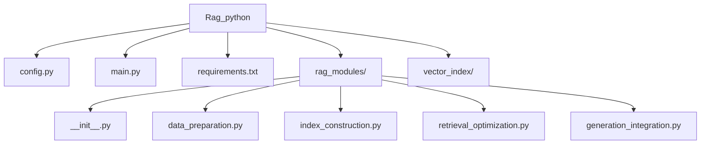
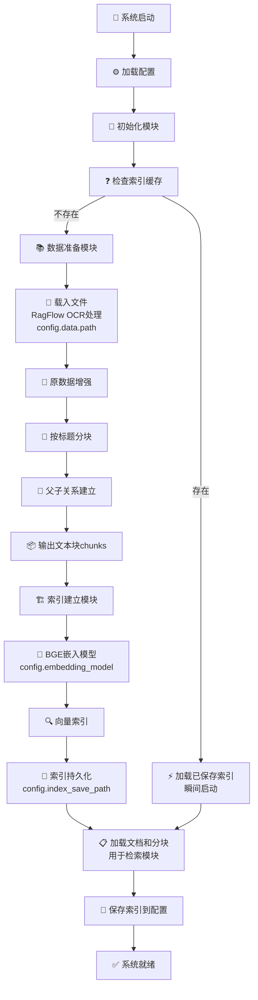
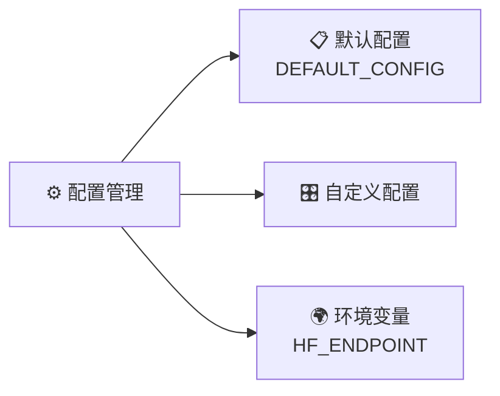

# 🚀 RAG Python 项目

> 一个基于 Python 的检索增强生成 (RAG) 系统实现

## 📁 项目结构

### 📋 详细目录说明

| 文件/目录 | 描述 | 功能 |
|-----------|------|------|
| **`config.py`** | ⚙️ 配置管理 | 系统配置参数和环境变量管理 |
| **`main.py`** | 🎯 主程序入口 | 应用程序启动和流程控制 |
| **`requirements.txt`** | 📦 依赖列表 | 项目所需的 Python 包依赖 |
| **`rag_modules/`** | 🧩 核心模块 | RAG 系统的核心功能模块 |
| **`vector_index/`** | 🗂️ 向量索引缓存 | 自动生成的向量存储目录 |

### 🔧 核心模块详解

#### `rag_modules/` 目录结构

| 模块文件 | 功能描述 | 主要作用 |
|----------|----------|----------|
| **`__init__.py`** | 📦 模块初始化 | 包初始化和导出接口 |
| **`data_preparation.py`** | 📚 数据准备模块 | 数据预处理、清洗和格式化 |
| **`index_construction.py`** | 🏗️ 索引构建模块 | 向量索引的创建和管理 |
| **`retrieval_optimization.py`** | 🔍 检索优化模块 | 检索算法优化和相关性提升 |
| **`generation_integration.py`** | 🤖 生成集成模块 | LLM 集成和响应生成 |

## 🎯 系统架构

本 RAG 系统采用模块化设计，主要包含以下组件：

1. **数据准备层** - 负责数据的预处理和清洗
2. **索引构建层** - 构建高效的向量检索索引
3. **检索优化层** - 优化检索算法和相关性排序
4. **生成集成层** - 集成大语言模型进行内容生成

## 🔄 系统工作流程

### 启动阶段

### 配置管理系统

### 核心处理流程

#### 1. 数据准备阶段
- **📄 文件载入**: 使用 RagFlow OCR 技术处理各类文档
- **📍 配置路径**: `config.data.path` 指定数据源位置
- **🔗 数据增强**: 对原始数据进行结构化增强
- **📝 智能分块**: 按标题层次进行文档分块
- **👥 关系建立**: 建立文档块之间的父子关系
- **📦 输出**: 生成结构化的文本块 chunks

#### 2. 索引构建阶段
- **🧠 嵌入模型**: 使用 BGE (Beijing Academy of Artificial Intelligence) 模型
- **📍 模型配置**: `config.embedding_model` 指定模型路径
- **🔍 向量化**: 将文本块转换为高维向量
- **💾 持久化**: 保存索引到 `config.index_save_path`
- **⚡ 缓存机制**: 支持索引的快速加载和复用

#### 3. 检索优化阶段
- **🎯 相似度计算**: 基于向量相似度进行文档检索
- **📊 相关性排序**: 对检索结果进行智能排序
- **🔧 算法优化**: 持续优化检索效率和准确性

#### 4. 生成集成阶段
- **🤖 LLM 集成**: 与大语言模型无缝集成
- **💬 上下文构建**: 结合检索结果构建上下文
- **📝 响应生成**: 生成准确、相关的回答

## 🚀 系统特色

### ✨ 核心优势
- **⚡ 快速启动**: 支持索引缓存，实现瞬间启动
- **🧠 智能处理**: 集成 RagFlow OCR，支持多格式文档
- **🔧 灵活配置**: 多层次配置管理系统
- **📊 高效检索**: BGE 向量模型，检索精度高
- **👥 结构化**: 智能分块和关系建立

### 🛠️ 技术栈
- **🐍 Python**: 核心开发语言
- **🧠 BGE**: 向量嵌入模型
- **📄 RagFlow**: OCR 文档处理
- **🔍 向量检索**: 高效相似度搜索
- **⚙️ 配置管理**: 灵活的参数配置

---

*💡 这是一个结构清晰、模块化的 RAG 系统实现，集成了先进的文档处理和向量检索技术，便于维护和扩展。*
